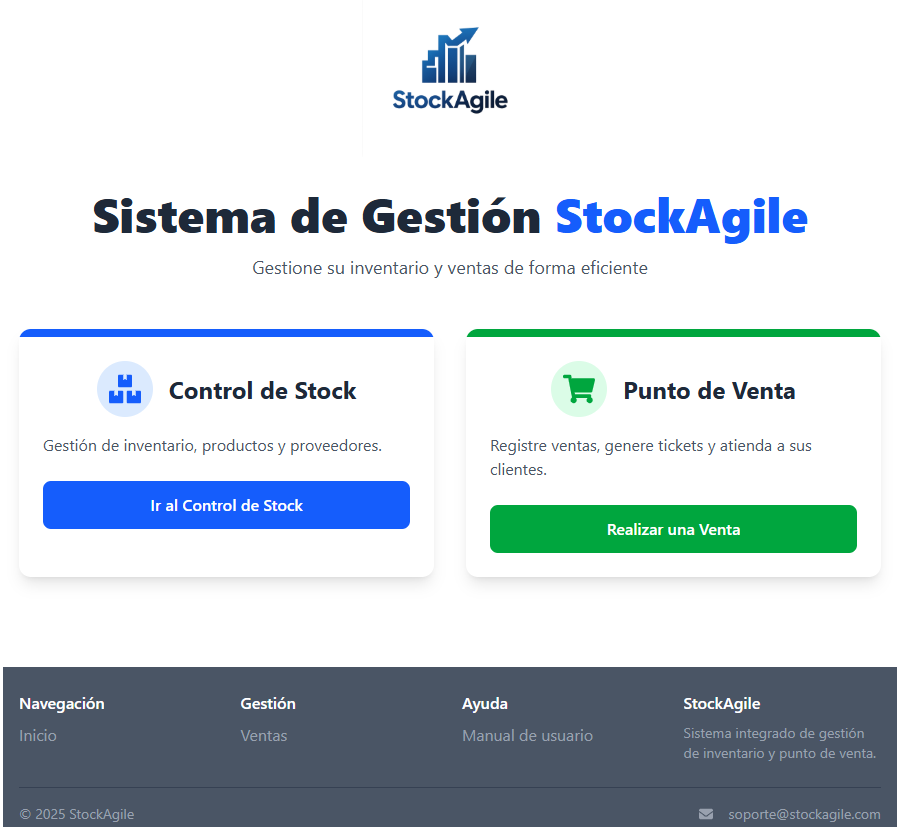
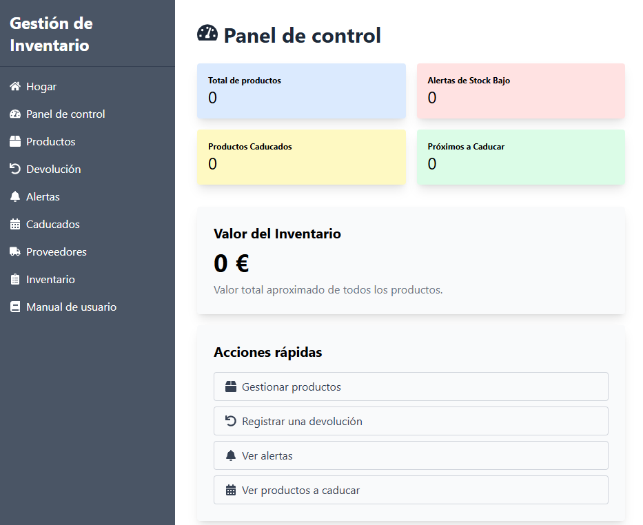
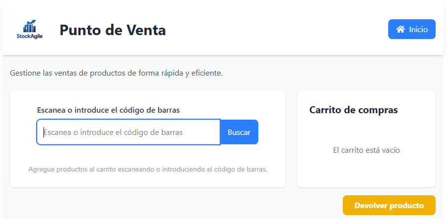
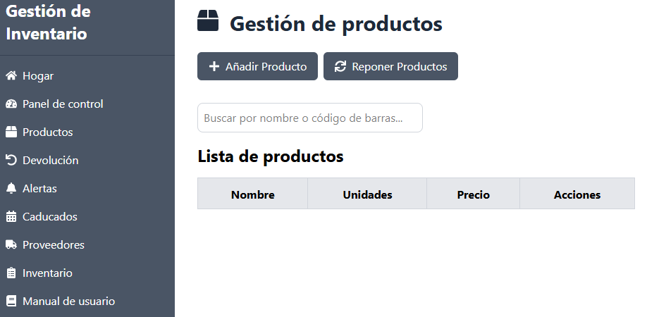
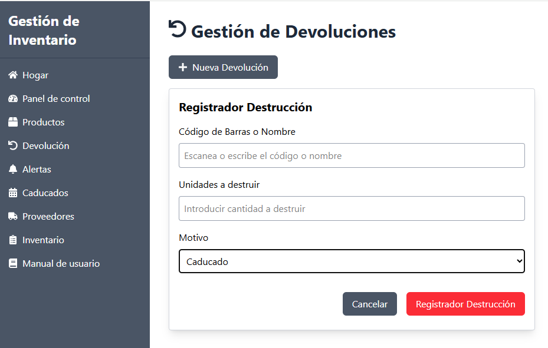
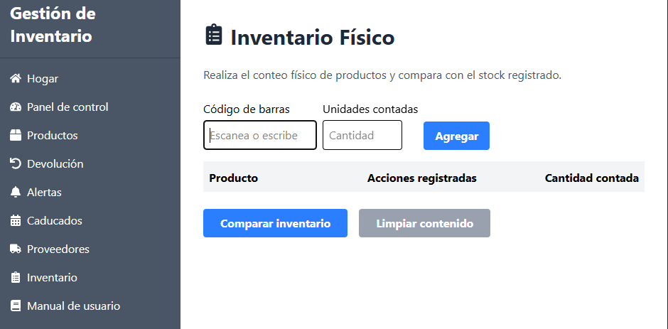

# StockAgile - Sistema de Gestión de Inventario y Punto de Venta

StockAgile es una aplicación web completa para la gestión de inventario y ventas, especialmente diseñada para pequeñas y medianas empresas que necesitan un control eficiente de su stock y operaciones comerciales.

---

## 📸 Capturas de pantalla

### Página Principal
Interfaz intuitiva con acceso rápido a todas las funcionalidades principales.


### Panel de Control
Vista general del estado del inventario con métricas clave y alertas importantes.


### Punto de Venta
Sistema de ventas rápido y eficiente con generación automática de tickets.


### Gestión de Productos
Control completo del inventario con alertas automáticas de stock bajo.


### Gestión de Devoluciones
Registro y seguimiento de productos caducados o dañados.


### Control de Inventario
Herramientas para conteos físicos y auditorías de stock.


---

## Características principales

- **Gestión completa de productos:** Añade, edita, elimina y repone productos con control avanzado de stock y umbrales personalizables.
- **Control inteligente de caducidad:** Monitorea productos próximos a vencer y gestiona destrucciones con registro detallado.
- **Gestión de proveedores:** Administra información de proveedores y visualiza productos asociados.
- **Punto de venta integrado:** Procesa ventas rápidamente con generación automática de tickets y gestión de cambios.
- **Sistema de alertas:** Notificaciones automáticas para stock bajo, productos próximos a caducar y otras situaciones críticas.
- **Inventario físico:** Realiza conteos físicos y compara automáticamente con el stock registrado.
- **Manual integrado:** Guía de usuario completa accesible desde la aplicación.

---

## Tecnologías utilizadas

### Frontend
- **React 18** - Framework principal
- **Vite** - Herramienta de construcción rápida
- **TailwindCSS** - Framework de estilos
- **React Router** - Navegación SPA
- **React Icons** - Iconografía
- **Axios** - Cliente HTTP

### Backend
- **Flask** - Framework web de Python
- **MongoDB** - Base de datos NoSQL
- **Flask-CORS** - Manejo de CORS
- **PyMongo** - Driver de MongoDB

---

## Instalación y configuración

### Requisitos previos

- **Node.js** (v16 o superior) y npm
- **Python** 3.8 o superior
- **MongoDB** (local o remoto)

### Configuración del Backend

1. Navega a la carpeta del backend:
   ```sh
   cd backend
   ```
2. Crea un entorno virtual y actívalo:
   ```sh
   python -m venv venv
   source venv/bin/activate
   ```
3. Instala las dependencias:
   ```sh
   pip install -r requirements.txt
   ```
4. Configura la base de datos en `config.py`.
5. Inicia el servidor:
   ```sh
   flask run
   ```

### Configuración del Frontend

1. Navega a la carpeta del frontend:
   ```sh
   cd frontend
   ```
2. Instala las dependencias:
   ```sh
   npm install
   ```
3. Inicia la aplicación:
   ```sh
   npm run dev
   ```

---

## Uso

Accede a la aplicación desde tu navegador en `http://localhost:3000`. Crea una cuenta de usuario y sigue el manual de usuario integrado para familiarizarte con todas las funcionalidades.


---

## Licencia

Este proyecto es propiedad de Mayra Barrantes Pi y todos los derechos están reservados. Contacta para usos comerciales.


## Contacto

Para más información, sugerencias o reportar problemas, por favor contacta al desarrollador:

- **Desarrollador:** [jeilmivi@gmail.com](mailto:jeilmivi@gmail.com)

---

¡Gracias por usar StockAgile! Tu solución integral para la gestión de inventario y ventas.